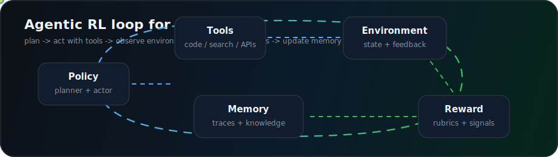

# Zhang Jie / Deep-Octopus

  
  
  

## Current Focus

I am focused on Agentic RL and LLM systems: how agents plan, call tools, use memory, learn from trajectories, and get evaluated with reliable reward and feedback loops. I care about the engineering layer that turns research ideas into products people can actually use.

<table>
  <tr>
    <td width="33%">
      <strong>Agentic RL</strong> 
      Tool-use trajectories, reward signals, exploration, credit assignment, and evaluation loops for agents.
    </td>
    <td width="33%">
      <strong>LLM Agents</strong> 
      Planning, memory, retrieval, tool calling, multi-step reasoning, and human-in-the-loop workflows.
    </td>
    <td width="33%">
      <strong>AI Products</strong> 
      Research assistants, workflow automation, dashboards, and lightweight full-stack prototypes.
    </td>
  </tr>
</table>

## Agentic Systems Workbench

| Layer | What I am exploring |
| --- | --- |
| Policy and planning | Agent loops, tool selection, reflective planning, task decomposition |
| Reward and feedback | Trajectory scoring, rubrics, preference signals, report-quality evaluation |
| Memory and knowledge | RAG, evidence graphs, long-running context, domain knowledge curation |
| Observability | Agent traces, async job dashboards, failure analysis, experiment reports |
| Product surface | Practical web apps and bots that make agent behavior visible and useful |

## Project Map

| Project | Direction | Notes |
| --- | --- | --- |
| [lingshu-nexus](https://github.com/Deep-Octopus/lingshu-nexus) | LLM knowledge system | Research evidence platform for acupuncture and tVNS/taVNS scenarios. |
| [decision-twin.skill](https://github.com/Deep-Octopus/decision-twin.skill) | Agentic decision support | Codex skill for building a decision twin from context, constraints, values, and history. |
| [feishu-project-bot](https://github.com/Deep-Octopus/feishu-project-bot) | LLM workflow automation | Feishu bot that parses project updates, tracks progress, and generates reports. |
| [GitCommit2Report](https://github.com/Deep-Octopus/GitCommit2Report) | Developer productivity | Turns Git commit history into structured weekly reports with LLM assistance. |
| [transformer-explore](https://github.com/Deep-Octopus/transformer-explore) | Model understanding | Lightweight visual exploration around transformer concepts. |
| [arq_dashboard](https://github.com/Deep-Octopus/arq_dashboard) | Agent infrastructure | Redis-backed dashboard for ARQ background jobs and async task visibility. |
| [meme-maker](https://github.com/Deep-Octopus/meme-maker) | AI web product | Lightweight AI meme generator with multi-image upload, AI copywriting, and export flow. |

## Stack

  
  
  
  
  
  
  
  
  
  

## Live Signals

<picture>
  <source
    srcset="https://github-readme-stats.vercel.app/api?username=Deep-Octopus&show_icons=true&theme=github_dark&hide_border=true"
    media="(prefers-color-scheme: dark)"
  />
  <source
    srcset="https://github-readme-stats.vercel.app/api?username=Deep-Octopus&show_icons=true&theme=default&hide_border=true"
    media="(prefers-color-scheme: light), (prefers-color-scheme: no-preference)"
  />
  
</picture>

<picture>
  <source
    srcset="https://github-readme-stats.vercel.app/api/top-langs/?username=Deep-Octopus&layout=compact&theme=github_dark&hide_border=true&hide=Jupyter%20Notebook"
    media="(prefers-color-scheme: dark)"
  />
  <source
    srcset="https://github-readme-stats.vercel.app/api/top-langs/?username=Deep-Octopus&layout=compact&theme=default&hide_border=true&hide=Jupyter%20Notebook"
    media="(prefers-color-scheme: light), (prefers-color-scheme: no-preference)"
  />
  
</picture>

<picture>
  <source media="(prefers-color-scheme: dark)" srcset="https://raw.githubusercontent.com/Deep-Octopus/Deep-Octopus/output/github-contribution-grid-snake-dark.svg">
  <source media="(prefers-color-scheme: light), (prefers-color-scheme: no-preference)" srcset="https://raw.githubusercontent.com/Deep-Octopus/Deep-Octopus/output/github-contribution-grid-snake.svg">
  
</picture>

## Recent Direction

- Building LLM agents with clearer feedback, tracing, and evaluation loops.
- Studying how reinforcement learning ideas can improve tool-use agents.
- Turning research evidence and project context into structured systems that agents can use.

## Contact

The best way to reach me is through GitHub: open an issue in a relevant repository or start from [Deep-Octopus](https://github.com/Deep-Octopus).
